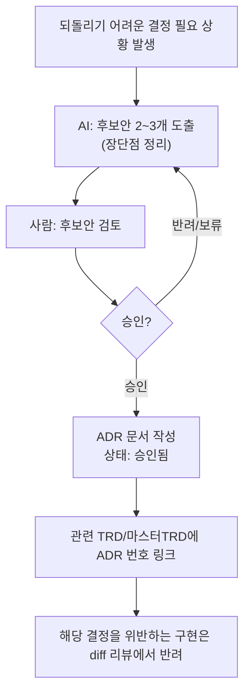

# 아키텍처 결정 기록 (ADR — Architecture Decision Record)

> 목적: `harness_00 §4-1`의 "되돌리기 어려운 결정은 AI가 혼자 확정하지 못한다"를
> 실제로 지키려면, 그 결정이 **왜** 그렇게 내려졌는지 기록이 남아야 합니다.
> 기록이 없으면 3개월 뒤 "이거 왜 이렇게 했지?"에 아무도 답을 못하고,
> 같은 논쟁을 반복하거나 실수로 결정을 뒤집게 됩니다.

---

## 언제 ADR을 작성해야 하는가 [체크리스트]
아래 중 하나라도 해당하면 반드시 작성:
- [ ] 데이터 모델(스키마) 구조를 확정/변경할 때
- [ ] 인증/인가 방식을 선택할 때 (세션 vs 토큰, 역할 구조 등)
- [ ] 삭제 정책(물리삭제/소프트삭제)을 정할 때
- [ ] 핵심 기술 스택(언어/프레임워크/DB)을 선택할 때
- [ ] 여러 단위에 영향을 주는 공통 규약을 정할 때
- [ ] 한 번 정하면 되돌리는 데 1주일 이상 걸릴 것으로 예상되는 모든 결정

## ADR 개별 항목 템플릿

```
### ADR-{번호}: {결정 제목}
- 날짜:
- 상태: 제안됨 / 승인됨 / 폐기됨 / 대체됨(ADR-xx로)
- 결정권자:

**배경 (Context)**
왜 이 결정이 필요했는가, 어떤 제약이 있었는가.

**검토한 대안 (Options)**
| 대안 | 장점 | 단점 |
|---|---|---|
| A안 | | |
| B안 | | |

**결정 (Decision)**
최종 선택한 안과 핵심 이유 한 문단.

**결과/트레이드오프 (Consequences)**
이 결정으로 포기한 것, 나중에 발목 잡을 수 있는 지점.

**관련 문서**
관련 TRD:
```

## ADR 처리 절차



## 프로젝트 ADR 기록 (class-attend / 프로젝트 코드: att)

### ADR-001: 지점(테넌트) 데이터 격리 전략
- 날짜: 2026-09-05
- 상태: 승인됨
- 결정권자: 정찬성(프로젝트 오너)

**배경 (Context)**
요구사항 정의 중 대상 규모가 "단일 학원"이 아니라 "다수 지점 프랜차이즈(수천 명
규모, 복수 원장)"로 확인됨. 각 지점의 학생·출결 데이터는 서로 분리되어야 하고
(다른 지점 원장이 남의 지점 학생을 볼 수 없어야 함), 동시에 프랜차이즈
본사(관리자)는 전체 지점을 통합 조회할 수 있어야 함.

**검토한 대안 (Options)**
| 대안 | 장점 | 단점 |
|---|---|---|
| A안: 단일 DB + 모든 테이블에 `branch_id` 컬럼 | 구현·운영 가장 단순, 본사 통합조회가 단순 WHERE 절 제거로 해결, 지점 추가 비용 거의 없음 | 애플리케이션 코드의 모든 쿼리에 `branch_id` 필터링을 빠짐없이 적용해야 함 — 누락 시 지점 간 데이터 유출 위험 |
| B안: 단일 DB + 지점별 스키마 분리 | 지점 간 격리 수준이 물리적으로 더 높음 | 지점 수 증가 시 스키마 관리·마이그레이션·본사 통합조회 쿼리가 모두 복잡해짐 |

**결정 (Decision)**
A안(단일 DB + `branch_id` 컬럼) 채택. 수천 명 규모에서 스키마 분리가 주는 격리
이득보다 본사 통합조회 용이성과 운영 단순성이 더 크다고 판단.

**결과/트레이드오프 (Consequences)**
- 모든 테이블(학생/반/출결/감사로그 등)에 `branch_id`(FK)를 필수 컬럼으로 추가한다.
- **핵심 위험**: 애플리케이션 계층에서 `branch_id` 필터를 빠뜨리는 쿼리가 하나라도
  있으면 지점 간 개인정보 유출로 직결된다. → `harness_13_tech_conventions.md`에
  "모든 조회 쿼리는 현재 로그인 사용자의 `branch_id`(프랜차이즈 관리자는 예외)로
  반드시 필터링한다"를 전역 규칙으로 명시하고, 코드 리뷰 체크리스트에도 반영할 것.
- 프랜차이즈 관리자 역할은 `branch_id` 필터를 우회할 수 있는 유일한 역할로 명시적
  으로 구분되어야 한다.

**관련 문서**
관련 TRD: `docs/trd/att_master_trd.md`

---

### ADR-002: 학생-반-강사 관계 구조
- 날짜: 2026-09-05
- 상태: 승인됨
- 결정권자: 정찬성(프로젝트 오너)

**배경 (Context)**
학원 현실상 한 학생이 여러 과목(반)을 동시에 수강하고, 한 반에 여러 강사가
공동으로 배정(예: 주강사+보조강사)될 수 있는지 확인이 필요했음.

**검토한 대안 (Options)**
| 대안 | 장점 | 단점 |
|---|---|---|
| A안: 학생 1명 = 1개 반만 소속, 반당 강사 1명 | 테이블 구조가 가장 단순(1:N만 존재) | 여러 과목을 듣는 실제 학원 운영과 맞지 않음 |
| B안: 학생-반 다대다, 반-강사는 1:N | 학생의 다중 수강은 반영하되 강사 구조는 단순 | 공동수업(보조강사 등)을 표현 못 함 |
| C안: 학생-반 다대다, 반-강사도 다대다(공동수업 허용) | 실제 학원 운영 현실을 가장 폭넓게 반영 | 매핑 테이블이 2개(학생-반, 반-강사) 추가되어 데이터모델이 가장 복잡함 |

**결정 (Decision)**
C안 채택 — `학생-반` 다대다, `반-강사` 다대다. 매핑 테이블 2종
(`student_class`, `class_teacher`)을 별도로 둔다.

**결과/트레이드오프 (Consequences)**
- 출결 체크 화면(U3)에서 "이 강사가 이 반의 배정 강사인지" 검증 로직이 필요함
  (`class_teacher` 매핑에 없는 강사는 해당 반 출결을 체크할 수 없어야 함).
- 학생 목록 조회 시 학생이 여러 반에 걸쳐 나타날 수 있으므로, 화면 설계 시
  "학생 상세"와 "반별 명단"을 구분해서 다뤄야 함.
- 향후 반 폐강/강사 교체 시 매핑 테이블만 갱신하면 되므로 유연성은 높음.

**관련 문서**
관련 TRD: `docs/trd/att_master_trd.md` (U2. 학생·반 관리, U3. 출결 체크)

---

### ADR-003: 계정 삭제 정책 (소프트 삭제만, 물리 삭제 금지)
- 날짜: 2026-09-05
- 상태: 승인됨
- 결정권자: 정찬성(프로젝트 오너)

**배경 (Context)**
U1(지점·계정 관리) TRD 작성 중 계정 삭제 정책이 미결 항목으로 남아있었음.
삭제 정책은 하네스 원칙 8 대상(되돌리기 어려운 결정)이라 후보안만 제시하고
승인을 받음.

**검토한 대안 (Options)**
| 대안 | 장점 | 단점 |
|---|---|---|
| A안: 소프트 삭제만 (status=inactive), 물리 삭제 기능 자체를 제공하지 않음 | 감사로그(U7)가 참조하는 행위자·대상 레코드가 항상 존재함이 보장됨(무결성) | 비활성 계정 데이터가 영구 누적됨 |
| B안: 관리자 요청 시 물리 삭제 허용 | 저장공간 정리, 개인정보 완전 삭제 요청 대응 가능 | 과거 감사로그가 참조하는 대상(FK)이 끊겨 "누가 무엇을 했는지" 이력이 훼손될 위험 |

**결정 (Decision)**
A안 채택 — 계정은 항상 비활성화(소프트 삭제)만 하며, 계정 자체의 물리 삭제
기능은 제공하지 않는다.

**결과/트레이드오프 (Consequences)**
- U1의 `PATCH /users/{id}/deactivate`가 계정 삭제의 유일한 수단이 되며,
  별도의 물리 삭제 API/기능은 만들지 않는다.
- 개인정보 완전 파기가 필요한 경우(퇴원 학생의 보유기간 경과 등)는 계정
  삭제가 아니라 U6(개인정보 생명주기)에서 **개인정보 필드 자체를 마스킹/
  파기**하는 별도 절차로 처리한다 — 계정 레코드(로그인용)와 개인정보
  파기는 서로 다른 문제로 분리해서 다룬다. U6 TRD 작성 시 구체 방식을
  다시 후보안으로 제시할 것.

**관련 문서**
관련 TRD: `docs/trd/att_u1_trd.md`, `docs/trd/att_master_trd.md`(U6)

---

## ADR 인덱스

| 번호 | 제목 | 상태 | 날짜 |
|---|---|---|---|
| ADR-001 | 지점(테넌트) 데이터 격리 전략 | 승인됨 | 2026-09-05 |
| ADR-002 | 학생-반-강사 관계 구조 | 승인됨 | 2026-09-05 |
| ADR-003 | 계정 삭제 정책 (소프트 삭제만) | 승인됨 | 2026-09-05 |
