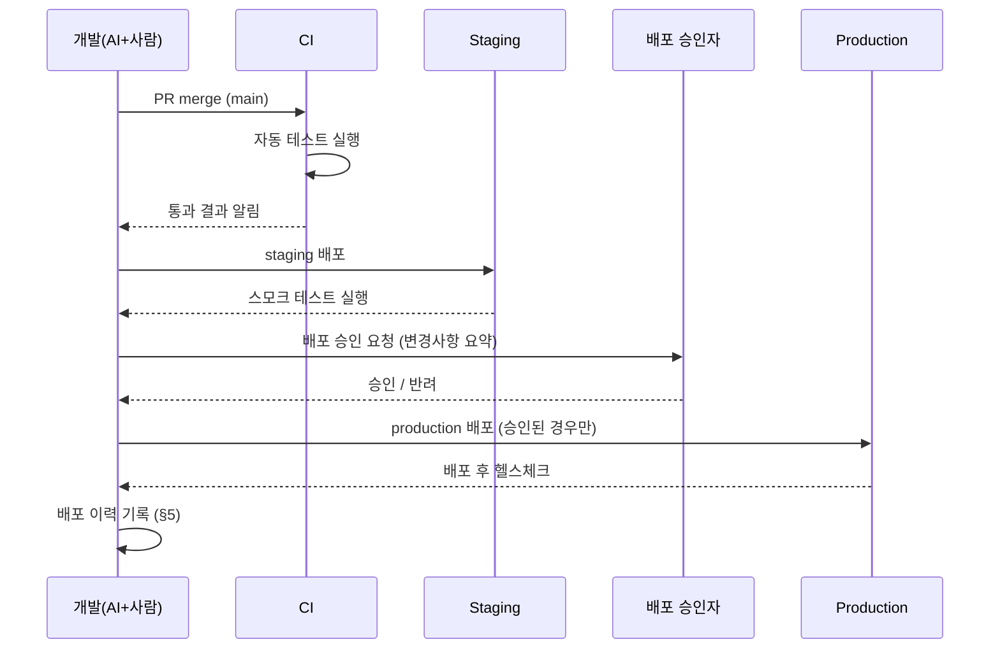
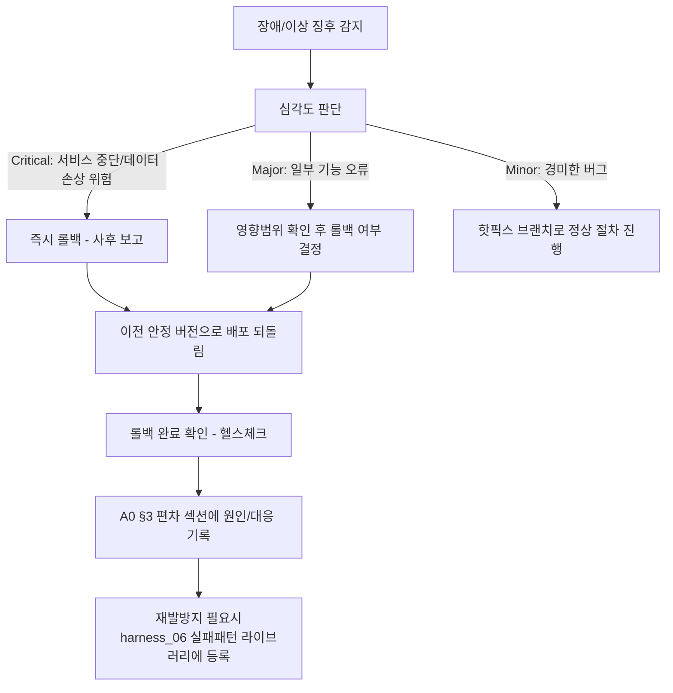

# 배포/롤백 절차 (Deployment & Rollback Runbook)

> 목적: `harness_05`는 "머지까지"만 다룹니다. 머지된 코드가 실제로 사용자에게
> 닿기까지, 그리고 문제가 생겼을 때 되돌리는 절차가 없으면 "코드는 완성됐는데
> 아무도 못 쓰는" 상태로 방치되거나, 장애가 났을 때 즉흥적으로 대응하다가
> 사태를 키우게 됩니다.

---

## §1. 환경 구성 (ADR-004: Next.js + PostgreSQL + Prisma)

| 환경 | 용도 | 데이터 | 접근 권한 | 인프라(제안) |
|---|---|---|---|---|
| local/dev | 개발/AI 에이전트 작업 | 마스킹 시드 데이터만 | 개발자 | `docker-compose.yml`의 로컬 PostgreSQL |
| staging | 배포 전 최종 확인 | 마스킹 또는 익명화 데이터 | 개발자+검수자 | Vercel Preview 배포 + 별도 Postgres 인스턴스(Neon/Supabase 등 무료 티어) |
| production | 실사용 | 실제 데이터 | 최소 인원, 별도 인증 | Vercel Production 배포 + 관리형 Postgres(Neon/Supabase/RDS 등) |

> **인프라 선택은 사용자 승인 필요(계정/결제가 필요한 외부 서비스이므로
> Claude가 대신 개설 불가)**. 위 표는 Next.js 앱 배포에 가장 마찰이 적은
> 조합(Vercel — Next.js 개발사 자체 플랫폼, 무료 티어로 시작 가능)을
> 제안한 것이며, 다른 클라우드(AWS/자체 서버 등)를 원하면 배포 절차만
> 바뀌고 애플리케이션 코드는 그대로 쓸 수 있다.

### §1-1. 필요 환경변수 (배포 전 반드시 설정)
| 변수 | 용도 | 비고 |
|---|---|---|
| `DATABASE_URL` | PostgreSQL 연결 문자열 | `.env.example` 참고 |
| `JWT_SECRET` | 로그인 세션 서명 키 | 운영 배포 전 반드시 무작위 문자열로 교체(개발용 기본값 절대 재사용 금지) |
| `CRON_SECRET` | U6 파기 배치(`GET /api/cron/purge-students`) 인증 | Vercel이 크론 요청 시 `Authorization: Bearer $CRON_SECRET` 헤더를 자동으로 붙여줌(Vercel Cron Jobs 표준 방식) |

### §1-2. 최초 배포 절차 (요약 — 실제 실행은 사용자가 직접)
1. Neon/Supabase 등에서 PostgreSQL 인스턴스 생성 → `DATABASE_URL` 확보.
2. `npx prisma migrate deploy` 실행(로컬 또는 CI에서, 운영 DB 대상) — 이
   저장소의 스키마(`prisma/schema.prisma`)를 그대로 반영.
2-1. `npm run db:seed` 실행 — **최초 franchise_admin 계정을 만드는 유일한
   방법**(모든 계정 발급 API가 이미 로그인된 franchise_admin을 전제하므로,
   최초 1회는 시드 스크립트로 부트스트랩해야 함). `SEED_ADMIN_EMAIL`/
   `SEED_ADMIN_PASSWORD` 환경변수로 초기 이메일/비밀번호 지정 가능
   (미지정 시 `prisma/seed.ts`의 기본값 사용 — 운영 DB에서는 반드시
   지정할 것). 로그인 후 최초 비밀번호 변경 화면으로 강제 이동됨.
3. Vercel 프로젝트 생성 → 이 저장소 연결 → §1-1 환경변수 등록.
4. `vercel.json`에 이미 정의된 크론(`/api/cron/purge-students`, 매일
   18:00 UTC = 03:00 KST)이 배포와 동시에 자동 등록됨(Vercel 자체 기능,
   추가 설정 불필요).
5. 배포 후 헬스체크: `POST /api/auth/login`이 정상 401/200을 반환하는지
   확인(단순 200 OK 페이지보다 실제 DB 연결까지 검증됨).

## §2. 배포 전 체크리스트
- [ ] 대상 브랜치의 AC 전부 pass
- [ ] CI 통과
- [ ] 사람 diff 리뷰 승인 완료
- [ ] A0 인수인계 문서 갱신 완료
- [ ] 롤백 계획(§4)을 배포 담당자가 숙지했는가

## §3. 배포 절차

- **위험 명령(스키마 변경, 대량 데이터 작업)은 AI 에이전트가 직접 production에
  실행하지 않는다** (`harness_05 §3` 원칙 재확인) — 사람이 별도 세션에서 직접 실행.

## §4. 롤백 절차

## §5. 배포 이력

| 일시 | 버전/브랜치 | 배포자 | 승인자 | 결과 | 비고 |
|---|---|---|---|---|---|

## §6. 롤백 결정권자
- [ ] 사람 작성: 누가 "즉시 롤백" 여부를 최종 결정하는가 (`harness_11 RACI` 참조)
