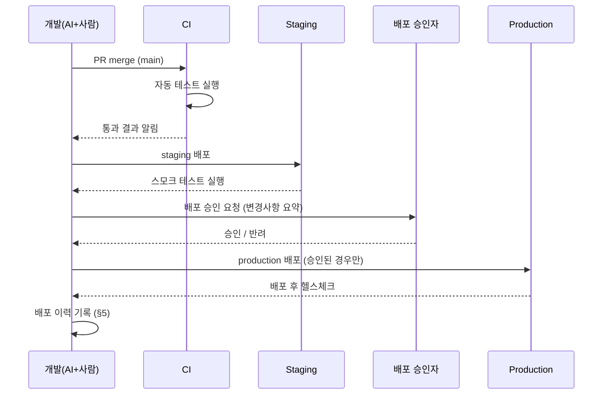
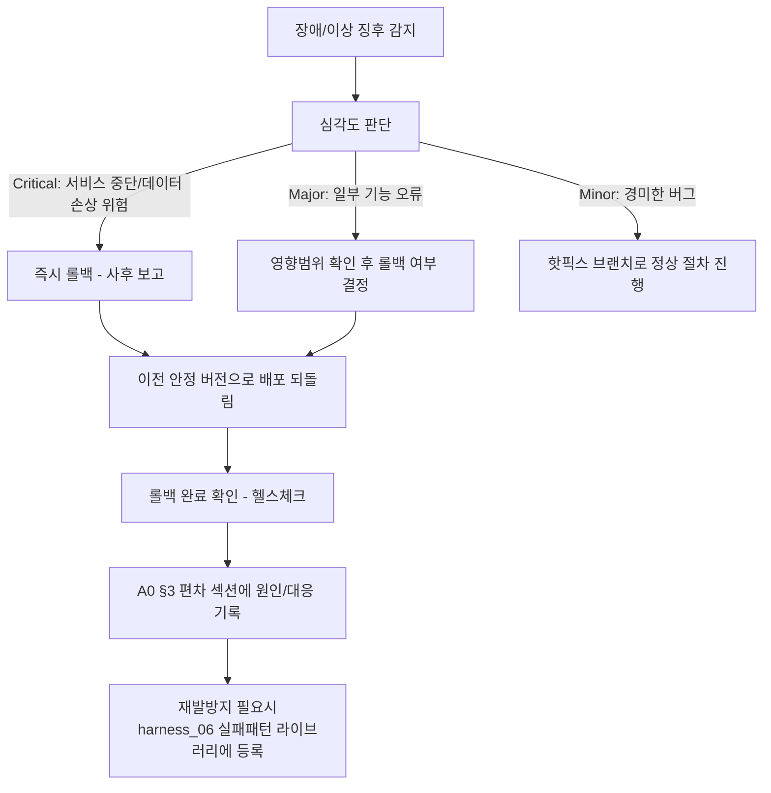

# 배포/롤백 절차 (Deployment & Rollback Runbook)

> 목적: `harness_05`는 "머지까지"만 다룹니다. 머지된 코드가 실제로 사용자에게
> 닿기까지, 그리고 문제가 생겼을 때 되돌리는 절차가 없으면 "코드는 완성됐는데
> 아무도 못 쓰는" 상태로 방치되거나, 장애가 났을 때 즉흥적으로 대응하다가
> 사태를 키우게 됩니다.

---

## §1. 환경 구성 [사람 작성 — 스택 확정 후]

| 환경 | 용도 | 데이터 | 접근 권한 |
|---|---|---|---|
| local/dev | 개발/AI 에이전트 작업 | 마스킹 시드 데이터만 | 개발자 |
| staging | 배포 전 최종 확인 | 마스킹 또는 익명화 데이터 | 개발자+검수자 |
| production | 실사용 | 실제 데이터 | 최소 인원, 별도 인증 |

## §2. 배포 전 체크리스트
- [ ] 대상 브랜치의 AC 전부 pass
- [ ] CI 통과
- [ ] 사람 diff 리뷰 승인 완료
- [ ] A0 인수인계 문서 갱신 완료
- [ ] 롤백 계획(§4)을 배포 담당자가 숙지했는가

## §3. 배포 절차

- **위험 명령(스키마 변경, 대량 데이터 작업)은 AI 에이전트가 직접 production에
  실행하지 않는다** (`harness_05 §3` 원칙 재확인) — 사람이 별도 세션에서 직접 실행.

## §4. 롤백 절차

## §5. 배포 이력

| 일시 | 버전/브랜치 | 배포자 | 승인자 | 결과 | 비고 |
|---|---|---|---|---|---|

## §6. 롤백 결정권자
- [ ] 사람 작성: 누가 "즉시 롤백" 여부를 최종 결정하는가 (`harness_11 RACI` 참조)
