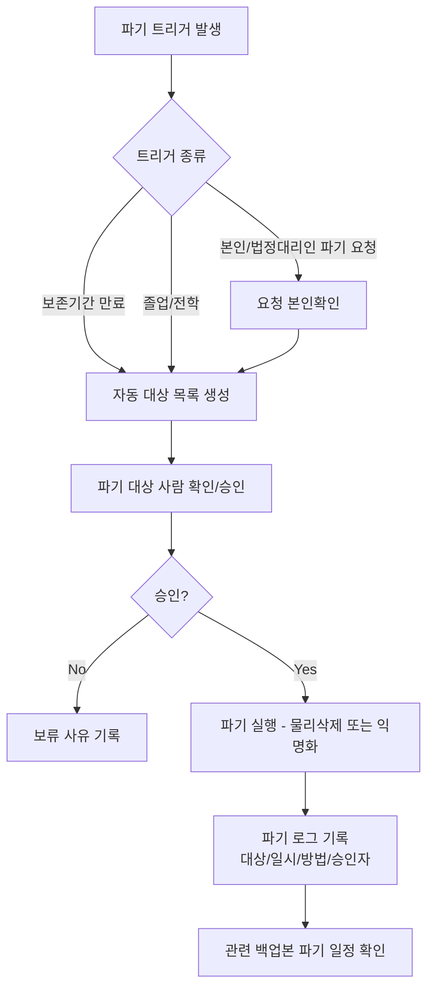
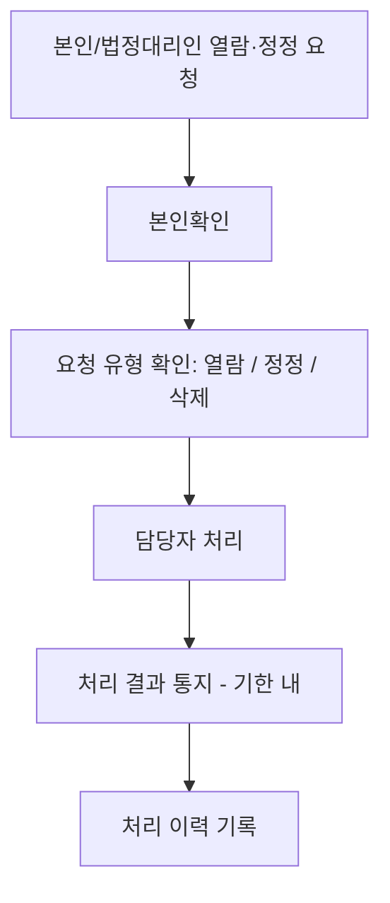

# 개인정보 생애주기 정책 (Data Retention & Disposal)

> 목적: `harness_05 §3`의 "마스킹/샘플 데이터"는 **개발 단계**의 이야기입니다.
> 이 문서는 **운영 단계**에서 실제 사용자/이해관계자 개인정보가 얼마나 보관되고,
> 언제·어떻게 파기되며, 당사자 요청 시 어떻게 열람/정정하는지를 다룹니다.
>
> ⚠️ 이 문서의 법적 기준(보존기간 등)은 AI나 개발자가 임의로 확정하지 않고,
> 반드시 사람(책임자/필요시 법무 검토)이 확정합니다 — `harness_00 §4-1`
> "되돌리기 어려운 결정" 원칙의 적용 대상입니다.

---

## §1. 적용 법령/근거
- 관련 법령: 대한민국 개인정보보호법 (실제 시행 전 법무 검토 필요 — 이
  문서의 보존기간·파기 방식은 프로젝트 결정 사항이며 법적 최종 검토를
  대체하지 않음)
- 미성년자 개인정보 특례 해당 여부: 학생 대부분이 미성년자로 추정됨.
  실제 서비스 오픈 전 미성년자 개인정보 처리 관련 법적 요건(법정대리인
  동의 등) 별도 검토 필요 — **아직 검토 안 됨, 배포 전 확인 항목**.

## §2. 데이터 항목별 보존기간 (ADR-005 승인, 2026-09-06)

| 데이터 항목 | 민감도 | 보존기간 | 파기 트리거 | 근거 |
|---|---|---|---|---|
| 학생 개인정보(이름·생년월일·연락처, `Student` 테이블) | 높음 | 퇴원(`withdrawnAt`) 후 **365일** | 퇴원 후 365일 경과 시 자동 배치 | ADR-005 |
| 학부모 계정(이메일·이름·연락처, `User` 테이블) | 높음 | 계정 비활성화(`status=inactive`) 후에도 물리 삭제 없음(ADR-003) — 마스킹 정책은 미정 | 아직 정의 안 됨 | §7 참고 |
| 출결 기록(`Attendance`) | 중간 | 학생 마스킹 이후에도 유지(통계 목적, 개인 식별 정보 없음) | 없음(영구 보관) | ADR-005 결과 |
| 감사로그(`AuditLog`) | 중간~높음(before/after에 개인정보 포함 가능) | 영구 보관 | 없음 | `att_u7_trd.md` §7 확정 |

## §2-1. 파기(마스킹) 대상 필드 — `att_u6_trd.md` §1 참고
`Student.name`, `Student.studentPhone`, `Student.guardianPhone`,
`Student.birthDate`는 파기 시 마스킹 값으로 대체된다(행 자체는 유지 —
ADR-005 근거). `Attendance`, `AuditLog`의 과거 기록은 그대로 둔다.

## §3. 파기 절차

## §4. 열람/정정 요청 처리 절차

## §5. 파기/처리 로그

| 일시 | 대상(익명화 표기) | 처리유형 | 처리자 | 승인자 |
|---|---|---|---|---|

## §7. 미성년자 개인정보 처리 — 기술적 조치 및 남은 미결 항목

**2026-09-06 구현한 기술적 안전장치** (법률 검토를 대체하지 않음 — 아래
"미결 항목" 참고):
- 학생 등록(`POST /students`) 시 `guardianConsent=true`가 없으면 422로
  거부되고, 성공 시 `Student.guardianConsentAt`에 동의 확인 시각을 남긴다
  (`att_u2_trd.md`). 즉 원장이 보호자 동의를 받았음을 확인해야만 시스템에
  학생 개인정보를 등록할 수 있다.
- 학부모 회원가입(`POST /auth/signup`) 시 `agreedToPrivacyPolicy=true`가
  없으면 422로 거부되고, 성공 시 `User.privacyAgreedAt`을 남긴다
  (`att_u1_trd.md`).
- 이 두 동의는 **UI에서 실제 약관/동의 문구를 보여주고 체크박스를 받는
  것까지가 한 세트**다 — API가 boolean 값만 받으므로, 실제 동의 문구
  내용과 노출 방식은 UI 구현 시 `harness_10` 본 문서를 근거로 확정한다.

**2026-09-06 추가: 법무 검토용 초안 문서** (여전히 변호사 검토 전 게시 금지)
- `docs/legal/privacy_policy_draft.md` — 개인정보처리방침 전문 초안
- `docs/legal/consent_texts_draft.md` — 회원가입/학생등록 동의 문구 초안
  (UI 화면 `src/app/signup/page.tsx`, `src/app/(app)/students/page.tsx`
  에서 링크로 연결됨: `/privacy-policy` 페이지)
- `docs/legal/legal_review_checklist.md` — 변호사에게 전달할 프로젝트
  특화 체크리스트(프랜차이즈 위수탁 구조, 미성년자 동의 방식 등)

**남은 미결 항목 (법률 검토 필요, 이 세션 범위 밖)**
- 위 초안의 법적 충분성 최종 검토 — 변호사/법무법인 필요.
- 만 14세 미만 아동에 대한 법정대리인 동의 특례가 "원장의 확인 체크"
  만으로 충분한지, 별도 서면/전자 동의 증빙이 필요한지(체크리스트 §2).
- 학부모(`User`, role=parent) 계정의 개인정보 마스킹 정책 — 학생과 달리
  "탈퇴 트리거"가 명확히 정의되지 않음(학부모는 자녀가 전부 퇴원해도
  계정 자체는 남아있을 수 있음). 별도 정책 확정 필요.

## §6. 개발 단계 원칙과의 연결
- 개발/AI 에이전트 환경에는 이 문서의 실제 데이터가 절대 들어가지 않는다
  (`harness_05 §3` 참조).
- 시드 데이터 마스킹 규칙은 `harness_14 테스트 데이터 관리`를 따른다.
