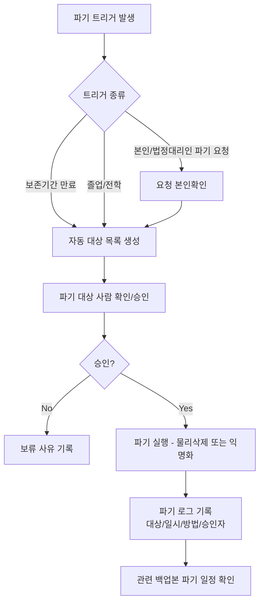
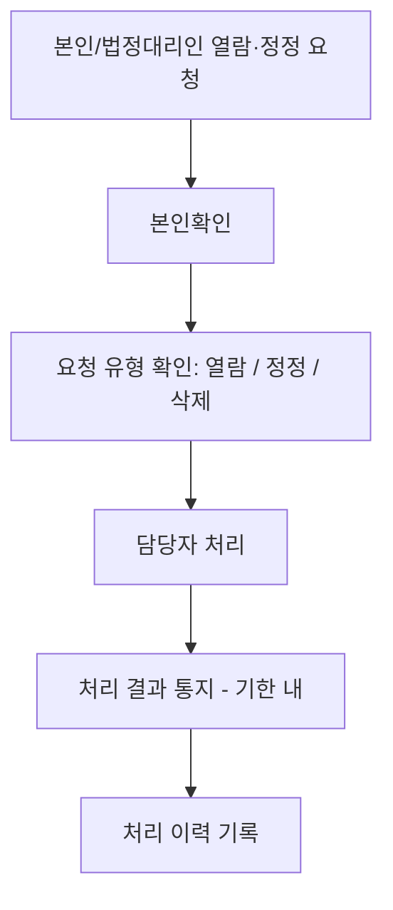

# 개인정보 생애주기 정책 (Data Retention & Disposal)

> 목적: `harness_05 §3`의 "마스킹/샘플 데이터"는 **개발 단계**의 이야기입니다.
> 이 문서는 **운영 단계**에서 실제 사용자/이해관계자 개인정보가 얼마나 보관되고,
> 언제·어떻게 파기되며, 당사자 요청 시 어떻게 열람/정정하는지를 다룹니다.
>
> ⚠️ 이 문서의 법적 기준(보존기간 등)은 AI나 개발자가 임의로 확정하지 않고,
> 반드시 사람(책임자/필요시 법무 검토)이 확정합니다 — `harness_00 §4-1`
> "되돌리기 어려운 결정" 원칙의 적용 대상입니다.

---

## §1. 적용 법령/근거 [사람 작성 — 법무 검토 권장]
- 관련 법령: (예: 개인정보보호법 등 — 실제 법률 검토 필요, AI가 단정하지 않음)
- 미성년자 개인정보 특례 해당 여부:

## §2. 데이터 항목별 보존기간 [사람 작성]

| 데이터 항목 | 민감도 | 보존기간 | 파기 트리거 | 근거 |
|---|---|---|---|---|
| 사용자 기본정보 | 높음 | | 탈퇴/계약종료 후 N년 | |
| 이용/활동 기록 | 중간 | | | |
| 관계자 연락처 | 높음 | | | |

## §3. 파기 절차

## §4. 열람/정정 요청 처리 절차

## §5. 파기/처리 로그

| 일시 | 대상(익명화 표기) | 처리유형 | 처리자 | 승인자 |
|---|---|---|---|---|

## §6. 개발 단계 원칙과의 연결
- 개발/AI 에이전트 환경에는 이 문서의 실제 데이터가 절대 들어가지 않는다
  (`harness_05 §3` 참조).
- 시드 데이터 마스킹 규칙은 `harness_14 테스트 데이터 관리`를 따른다.
