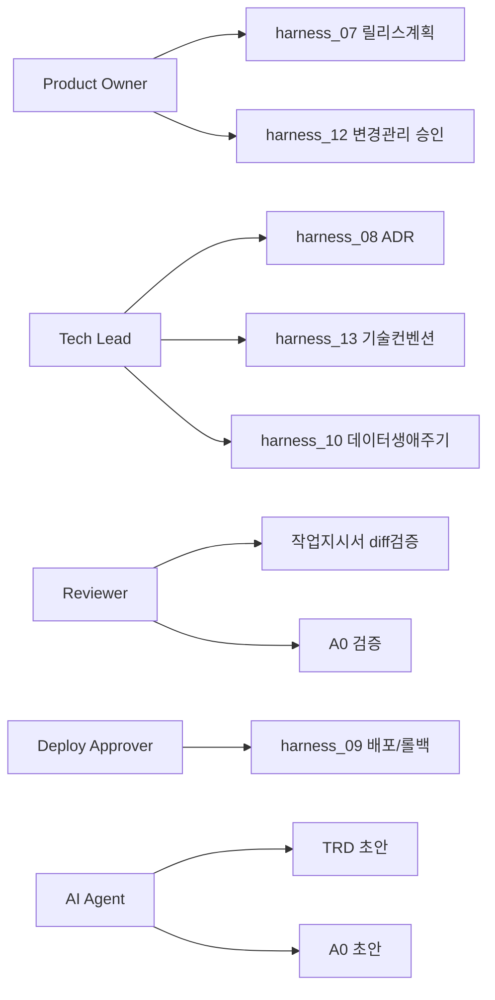

# 역할과 책임 (RACI)

> 목적: 지금은 1인이 여러 역할(기획/설계/승인/리뷰)을 겸하고 있어 문제가 안
> 보이지만, 팀이 커지거나 이 하네스를 다른 프로젝트/다른 팀에 이식하는 순간
> "TRD는 누가 최종 확정하나, merge는 누가 승인하나"가 불명확해지면 하네스
> 전체가 형식적으로 변합니다. 역할을 미리 명시해두면 이식성이 생깁니다.

---

## §1. 역할 정의 [사람 작성]

| 역할 | 정의 |
|---|---|
| Product Owner (기획) | 요구사항/우선순위/MVP 범위 최종 승인 |
| Tech Lead (설계) | ADR/기술 컨벤션/데이터모델 최종 승인 |
| Reviewer (검증) | diff 리뷰, AC pass/fail 판정 |
| Deploy Approver (운영) | 배포/롤백 승인 |
| AI Agent (실행) | 코드 작성, 테스트 실행, 초안 작성 |

> 1인 프로젝트인 경우: 모든 역할을 한 사람이 겸임하되, **역할 전환 시점을
> 스스로 명시**하세요 (예: "지금은 Reviewer 모자를 쓰고 diff를 본다"). 기획자
> 모드로 승인한 것을 개발자 모드에서 별 검토 없이 그대로 통과시키는 것을
> 방지하기 위함입니다.

## §2. RACI 매트릭스
R=실행책임, A=최종승인, C=협의, I=통보

| 활동 | Product Owner | Tech Lead | Reviewer | Deploy Approver | AI Agent |
|---|---|---|---|---|---|
| 마스터 TRD 작성 | A | C | | | C(초안) |
| 릴리스 계획(07) | A | C | | | C(초안) |
| ADR(08) 승인 | I | A | | | R(초안) |
| 단위 TRD AC 확정 | A | C | C | | C(초안) |
| 작업지시서 작성 | R | C | | | |
| 프롬프트 실행 | I | | | | R |
| diff 리뷰 | I | C | A/R | | |
| merge 승인 | | C | A | | |
| 배포 승인 | I | C | | A | |
| 롤백 결정 | I | C | | A/R | |
| A0 갱신 | I | I | C | | R(초안) |

## §3. 역할-문서 소유권

## §4. 1인 프로젝트 — "모자 전환" 실전 습관

> §1의 경고("역할 전환 시점을 스스로 명시하세요")는 실전에서 안 지켜지기
> 쉽다 — 말로만 있고 실제로 기록한 적이 없는 경우가 흔하다. 문서를 늘리는
> 대신, 커밋 메시지/승인 메시지에 붙이는 **한 단어 태그**로 대체한다
> (별도 문서 작성 부담 없이 습관화 가능).

| 태그 | 의미 | 예시 |
|---|---|---|
| `[기획]` | Product Owner 모자 — 범위/우선순위 결정 | "[기획] 이 기능을 이번 릴리스 범위에 포함하기로 함" |
| `[설계]` | Tech Lead 모자 — ADR/데이터모델/기술컨벤션 승인 | "[설계] ADR-00X 후보 B 채택" |
| `[리뷰]` | Reviewer 모자 — diff/AC pass-fail 판정 | "[리뷰] AC 전부 pass 확인, merge 승인" |
| `[배포]` | Deploy Approver 모자 — 배포/롤백 결정 | "[배포] 기준 브랜치 반영 승인" |

**규칙**: 같은 사람이 기획 모자로 승인한 걸 리뷰 모자 없이 그대로 개발 모드로
넘기지 않는다 — 최소한 커밋 메시지나 대화에서 태그를 한 번은 명시적으로
찍고 넘어간다. 이게 §1의 경고를 실제로 작동하게 만드는 최소 비용 장치다.
