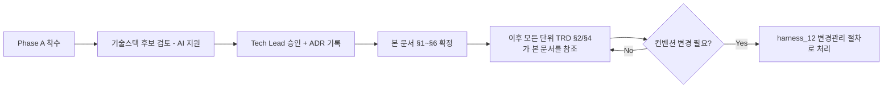

# 전역 기술 컨벤션 (Global Technical Conventions)

> 목적: 각 단위 TRD의 §2(함수/API 명세)는 단위별로 개별 정의됩니다. 이 문서가
> 없으면 AI 세션마다, 단위마다 API 응답 포맷/에러 코드 체계/네이밍이 미묘하게
> 달라져서 나중에 프론트/백엔드 통합 시점에 조립되지 않는 부품들이 나옵니다.
> **Phase A(프로젝트 착수)에서 1회 확정**하고, 이후 모든 단위 TRD는 이 문서를 따릅니다.

---

## §1. 기술 스택 [사람 작성 — ADR 링크]
- 언어/프레임워크:
- 데이터베이스:
- 관련 ADR:

## §2. API 설계 표준
- URL 네이밍 규칙:
- HTTP 메서드 사용 규칙:
- 요청/응답 공통 포맷:
- 에러 응답 공통 포맷 (모든 단위 TRD §4가 이 포맷을 따름):
- 버저닝 정책:

## §3. 인증/인가 공통 방식 [사람 작성 — ADR 링크]
- 인증 방식:
- 권한/역할 구조 (모든 단위 TRD §0-1 "권한" 항목이 참조):

## §4. 코딩 컨벤션
- 네이밍 규칙 (변수/함수/파일):
- 디렉토리 구조:
- 주석/문서화 규칙:

## §5. 로깅/에러 처리 표준
- 로그 포맷:
- 로그 레벨 기준:
- 개인정보가 로그에 남지 않도록 하는 규칙 (`harness_10` 연동):

## §6. 커밋/PR 컨벤션
- `harness_05 §1`의 브랜치/커밋 규칙을 그대로 따름 (여기서 중복 정의하지 않음).

## §7. 확정 절차

