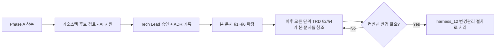

# 전역 기술 컨벤션 (Global Technical Conventions) — class-attend (att)

> 목적: 각 단위 TRD의 §2(함수/API 명세)는 단위별로 개별 정의됩니다. 이 문서가
> 없으면 AI 세션마다, 단위마다 API 응답 포맷/에러 코드 체계/네이밍이 미묘하게
> 달라져서 나중에 프론트/백엔드 통합 시점에 조립되지 않는 부품들이 나옵니다.
> Phase A(프로젝트 착수)에서 1회 확정하고, 이후 모든 단위 TRD는 이 문서를 따릅니다.

---

## §1. 기술 스택 [ADR-004]
- 언어/프레임워크: TypeScript, Next.js(App Router), React
- 데이터베이스: PostgreSQL
- ORM: Prisma (모든 단위 TRD §1 데이터 구조는 `prisma/schema.prisma`의 단일
  진실 공급원으로 옮겨짐)
- 이메일 발송(U1 임시 비밀번호, U5 등): Resend 사용을 기본으로 제안.
  **단, 실제 API 키는 사용자가 별도로 발급/제공해야 함** — 키가 없는 개발
  단계에서는 실제 발송 대신 콘솔 로그로 대체(mock)하고, U1 작업지시서
  §3에 이 예외를 명시한다.
- 관련 ADR: `harness_08_adr.md` ADR-004

## §2. API 설계 표준
- URL 네이밍 규칙: REST 리소스 기반, 소문자, 복수형 명사
  (예: `/api/students`, `/api/classes/{id}/roster`)
- HTTP 메서드 사용 규칙: 조회=GET, 생성=POST, 부분수정=PATCH, 소프트
  삭제/비활성화도 `PATCH .../deactivate`처럼 명시적 하위 경로 사용(물리
  삭제 의미의 DELETE는 계정·학생·출결·연결 등 개인정보 관련 리소스에는
  아예 라우트를 만들지 않음 — ADR-003 원칙).
- 요청/응답 공통 포맷: JSON. 성공 응답은 `{ "data": ... }`, 실패 응답은
  아래 에러 포맷을 따름.
- 에러 응답 공통 포맷 (모든 단위 TRD §4가 이 포맷을 따름):
  ```json
  { "error": { "code": "FORBIDDEN_BRANCH", "message": "사람이 읽을 수 있는 설명" } }
  ```
  `code`는 각 단위 TRD §4에 정의된 값을 그대로 사용.
- 버저닝 정책: 초기(v0.1)에는 버전 프리픽스 없이 시작(`/api/...`). 호환성이
  깨지는 변경이 필요해지면 그때 `/api/v2/...`로 분기(harness_12 변경관리
  절차를 통해서만).

## §3. 인증/인가 공통 방식 [ADR-004]
- 인증 방식: 커스텀 JWT. 비밀번호는 bcrypt로 해시 저장(U1 §7 비밀번호
  정책 참고). 로그인 성공 시 JWT를 httpOnly 쿠키로 발급, 만료 24시간
  (리프레시 토큰은 MVP 범위에서 다루지 않음 — 만료 시 재로그인).
- 권한/역할 구조 (모든 단위 TRD §0-1 "권한" 항목이 참조): JWT 클레임에
  `user_id`, `role`(franchise_admin/director/teacher/parent), `branch_id`
  (franchise_admin·parent는 null)를 포함. 모든 API 요청은 서버 미들웨어가
  이 클레임을 검증하여:
  1. `role`이 해당 API를 호출할 수 있는지 확인 (아니면 403 FORBIDDEN_ROLE)
  2. 대상 리소스의 `branch_id`가 요청자의 `branch_id`와 일치하는지 확인
     (franchise_admin은 예외, 아니면 403 FORBIDDEN_BRANCH — ADR-001)

## §4. 코딩 컨벤션
- 네이밍 규칙: TypeScript 변수/함수는 camelCase, 컴포넌트/타입/인터페이스는
  PascalCase, DB 컬럼은 snake_case(Prisma의 `@map`으로 매핑).
- 디렉토리 구조(제안):
  ```
  /app                 -- Next.js App Router 페이지
  /app/api/{resource}  -- API Route Handler (단위별 하위 폴더, 예: /app/api/students)
  /lib/auth            -- 인증/인가 미들웨어 (branch_id·role 검증 공통 로직)
  /lib/audit           -- U7 record_audit_log 공통 함수
  /prisma/schema.prisma -- 전체 데이터 모델
  ```
- 주석/문서화 규칙: 프로젝트 전역 방침과 동일 — 기본적으로 주석 없음,
  숨은 제약/이유(WHY)가 있을 때만 한 줄 주석.

## §5. 로깅/에러 처리 표준
- 로그 포맷: 구조화 JSON 로그(`level`, `timestamp`, `message`, 필요 시
  `requestId`).
- 로그 레벨 기준: `error`(요청 실패·예외), `warn`(정상 흐름 밖 상황),
  `info`(주요 이벤트, 예: 서버 시작).
- 개인정보가 로그에 남지 않도록 하는 규칙: 애플리케이션 일반 로그(콘솔/
  파일)에는 학생·보호자 이름/연락처/생년월일 등 개인정보 값을 그대로
  출력하지 않는다(ID만 로그, 값은 마스킹). 개인정보 조회/수정 이력은
  U7의 `AuditLog`에서만 별도 관리한다(harness_10 작성 시 보존기간 등
  추가 연동).

## §6. 커밋/PR 컨벤션
- `harness_05 §1`의 브랜치/커밋 규칙을 그대로 따름(여기서 중복 정의하지
  않음).
- **이 프로젝트 고유 예외 (CLAUDE.md 최우선 규칙)**: harness_05는 "AI
  에이전트가 브랜치를 만들고 커밋한다"는 일반 하네스의 기본 전제를
  깔고 있으나, 이 프로젝트의 CLAUDE.md는 **Claude가 git 관련 어떠한
  작업도 하지 않는다**고 명시한다. 따라서 `feature/{단위코드}` 브랜치
  생성, 커밋, 병합은 항상 **사용자가 직접** 수행하고, AI 에이전트는
  파일 변경(코드 작성)까지만 담당한다. 이 예외는 모든 작업지시서
  §0(전제 조건)에 반복 명시할 것.

## §7. 확정 절차



> 상태: **확정** (2026-09-06, ADR-004 승인 완료)
